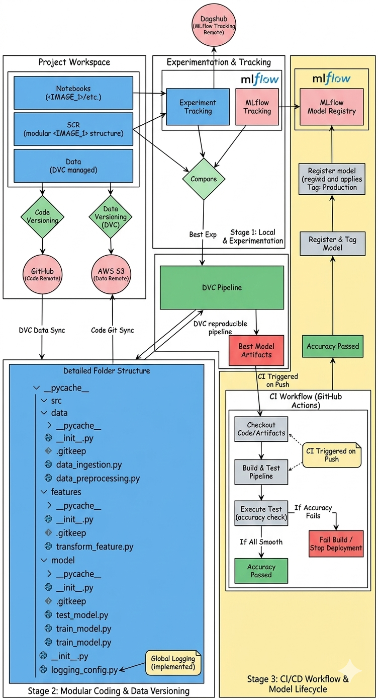

# Placement Prediction Model - END to END MLOPS Practices


This repository serves as the core development environment for the **Placement Prediction Model**. It focuses on the transition from exploratory data analysis to a robust, production-grade machine learning pipeline. By integrating **MLOps** principles, we ensure that every experiment is reproducible, every dataset is versioned, and every model is rigorously tested before being flagged for deployment.

---

## 🏗️ Development Architecture
The architecture below outlines the systematic flow from raw data ingestion to the final registration of the model in the production registry. It highlights the separation between local experimentation and the automated CI/CD validation gates.



---

## 🚀 Detailed Workflow Breakdown

### 1. Standardized Project Environment
To maintain consistency across development environments, we utilized **Cookiecutter**. This ensures a modular structure where configuration, source code, and data are strictly decoupled. This organization is vital for scaling the project and allowing multiple collaborators to work without merge conflicts in the notebook files.

### 2. Experimentation & Remote Tracking
* **Jupyter Notebooks:** Located in the `notebooks/` directory, these are used for initial EDA, feature importance analysis, and testing various algorithms (e.g., Random Forest, XGBoost).
* **MLflow Tracking:** Every training run logs parameters (learning rate, estimators), metrics (Accuracy, F1-Score), and artifacts.
* **Dagshub Integration:** By using Dagshub as our remote MLflow tracking URI, we maintain a centralized dashboard to compare experiments over time without losing local metadata.

### 3. Data & Pipeline Versioning (DVC)
Unlike traditional software, ML projects require versioning the data alongside the code.
* **DVC Pipelines:** We use `dvc.yaml` to define the dependencies and outputs of each stage. Running `dvc repro` ensures that if a data file or a script changes, only the affected downstream stages are re-executed.
* **Remote Storage (AWS S3):** Large datasets and model `.pkl` or `.onnx` files are not stored in Git. Instead, they are pushed to an **AWS S3 bucket**, keeping the GitHub repository lightweight while maintaining a full audit trail of data versions.

### 4. Automated CI/CD & Quality Gates
Our **GitHub Actions** workflow acts as the final gatekeeper:
* **Unit & Integration Tests:** Upon every push to the `main` or `dev` branch, the system builds the environment and runs the modular pipeline.
* **The Accuracy Gate:** A specialized script, `test_model.py`, evaluates the trained artifact against a held-out test set. 
* **Conditional Registration:** If and only if the model passes the performance threshold, the workflow interacts with the **MLflow Model Registry** to register the new version and apply the `Production` tag.

---

## 📂 Enhanced Folder Structure
```text
.
├── .github/
│   └── workflows/       <- CI/CD YAML files for automated 

├── src/
│   ├── data/            <- Scripts for ingestion and preprocessing logic
│   ├── features/        <- Engineering scripts to transform raw data into features
│   ├── model/           <- Logic for training, evaluating, and testing models
│   └── logging_config.py<- Centralized logging to track pipeline execution

├── dvc.yaml             <- Defines the DAG (Directed Acyclic Graph) of the pipeline
├── dvc.lock             <- Records the exact state of data and code for reproduction
├── params.yaml          <- Centralized hyperparameters for easy tuning
└── requirements.txt     <- Python dependencies
```

Markdown
# Placement Prediction Model - Development Stage

This repository serves as the core development environment for the **Placement Prediction Model**. It focuses on the transition from exploratory data analysis to a robust, production-grade machine learning pipeline. By integrating **MLOps** principles, we ensure that every experiment is reproducible, every dataset is versioned, and every model is rigorously tested before being flagged for deployment.

---

## 🏗️ Development Architecture
The architecture below outlines the systematic flow from raw data ingestion to the final registration of the model in the production registry. It highlights the separation between local experimentation and the automated CI/CD validation gates.


---

## 🚀 Detailed Workflow Breakdown

### 1. Standardized Project Environment
To maintain consistency across development environments, we utilized **Cookiecutter**. This ensures a modular structure where configuration, source code, and data are strictly decoupled. This organization is vital for scaling the project and allowing multiple collaborators to work without merge conflicts in the notebook files.

### 2. Experimentation & Remote Tracking
* **Jupyter Notebooks:** Located in the `notebooks/` directory, these are used for initial EDA, feature importance analysis, and testing various algorithms (e.g., Random Forest, XGBoost).
* **MLflow Tracking:** Every training run logs parameters (learning rate, estimators), metrics (Accuracy, F1-Score), and artifacts.
* **Dagshub Integration:** By using Dagshub as our remote MLflow tracking URI, we maintain a centralized dashboard to compare experiments over time without losing local metadata.

### 3. Data & Pipeline Versioning (DVC)
Unlike traditional software, ML projects require versioning the data alongside the code.
* **DVC Pipelines:** We use `dvc.yaml` to define the dependencies and outputs of each stage. Running `dvc repro` ensures that if a data file or a script changes, only the affected downstream stages are re-executed.
* **Remote Storage (AWS S3):** Large datasets and model `.pkl` or `.onnx` files are not stored in Git. Instead, they are pushed to an **AWS S3 bucket**, keeping the GitHub repository lightweight while maintaining a full audit trail of data versions.

### 4. Automated CI/CD & Quality Gates
Our **GitHub Actions** workflow acts as the final gatekeeper:
* **Unit & Integration Tests:** Upon every push to the `main` or `dev` branch, the system builds the environment and runs the modular pipeline.
* **The Accuracy Gate:** A specialized script, `test_model.py`, evaluates the trained artifact against a held-out test set. 
* **Conditional Registration:** If and only if the model passes the performance threshold, the workflow interacts with the **MLflow Model Registry** to register the new version and apply the `Production` tag.

---

## 📂 Enhanced Folder Structure
```text
.
├── .github/
│   └── workflows/       <- CI/CD YAML files for automated testing and registration
├── data/
│   ├── raw/             <- Original, immutable data (DVC tracked)
│   └── processed/       <- Cleaned data ready for training (DVC tracked)
├── notebooks/           <- Research-oriented notebooks for prototyping
├── src/
│   ├── data/            <- Scripts for ingestion and preprocessing logic
│   ├── features/        <- Engineering scripts to transform raw data into features
│   ├── model/           <- Logic for training, evaluating, and testing models
│   └── logging_config.py<- Centralized logging to track pipeline execution
├── dvc.yaml             <- Defines the DAG (Directed Acyclic Graph) of the pipeline
├── dvc.lock             <- Records the exact state of data and code for reproduction
├── params.yaml          <- Centralized hyperparameters for easy tuning
└── requirements.txt     <- Python dependencies
```
## 🔗 Transition to Deployment

Once a model is registered with the Production tag, it is picked up by our deployment infrastructure. The deployment repository handles the containerization of the model into a FastAPI service and manages the cloud infrastructure on AWS using a Blue-Green strategy for zero-downtime updates.

👉 View the FAST-API and Checkout Deployment Workflow: ## 🔗 
[](https://katherineoelsner.com/)